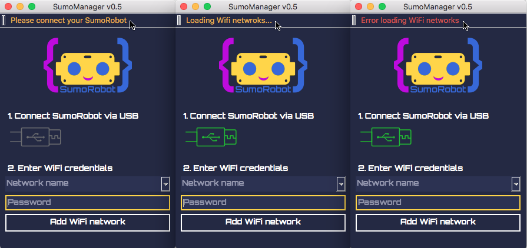
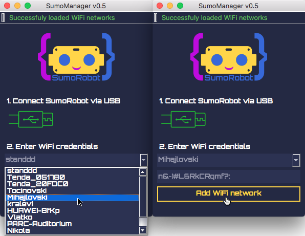

Download SumoManager for your operating system:

## Connecting the SumoRobot
Once you have your SumoRobot assembled you will need to upload it's software (firmware)  
on it. This can be done with the SumoManager, you can download it above. Once you launch  
the SumoManager you will see that it asks you to connect your SumoRobot with your  
computer using a micro USB cable. Once your SumoRobot is connected the SumoManager will  
try to load the WiFi networks the SumoRobot sees around him. This will fail as there is  
no firmware on the SumoRobot yet.  

## Updating Firmware
Then you can upload the newest firmware on the SumoRobot. From the application file menu  
choose **update firmware**. Then wait until the firmware downloads and gets uploaded to  
the SumoRobot.  

## Adding a WiFi network
Finally you can add your Wifi network to your SumoRobot, so it can remember it and  
automatically connect to it once you turn the SumoRobot on. First disconnect and  
reconnect your SumoRobot, so the WiFi networks are reloaded. Then select the network  
name from the list and enter the network password in the field below. Finally click . 
on the **Add WiFi network** button. You can also add more networks, so you can use it  
in several locations.  

